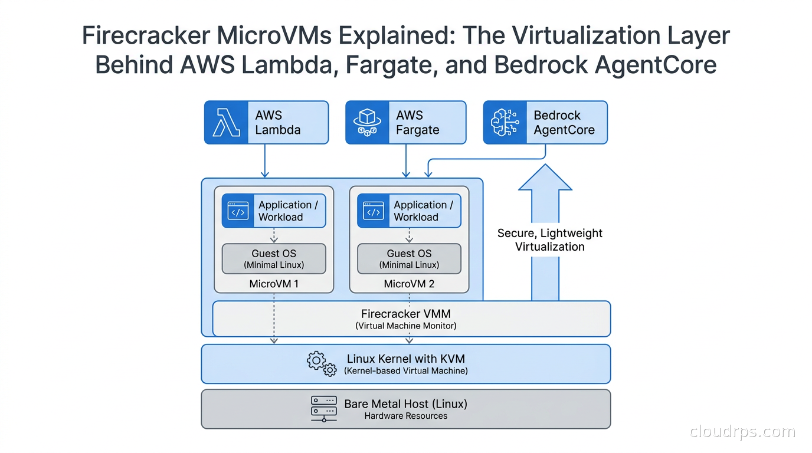

# Firecracker MicroVM Architecture

> Understanding the virtualization layer behind modern serverless platforms like AWS Lambda and AWS Fargate.

---

## Architecture Diagram

> **Insert the image below**



---

# Overview

Firecracker is an open-source **Virtual Machine Monitor (VMM)** developed by AWS.

It is designed to create and manage **MicroVMs**, which are lightweight virtual machines optimized for cloud-native workloads.

Unlike traditional virtual machines, Firecracker starts in milliseconds while providing strong isolation between workloads.

---

# Architecture Explanation

The architecture can be understood from **bottom to top**.

---

# 1. Bare Metal Host (Linux)

```
Bare Metal Host (Linux)
Hardware Resources
```

This is the physical server.

It contains:

- CPU
- RAM
- Storage (SSD)
- Network Interface

This layer provides the actual hardware resources.

Without this physical machine, no virtual machines can run.

---

# 2. Linux Kernel with KVM

```
Linux Kernel with KVM
(Kernel-based Virtual Machine)
```

KVM is a virtualization feature built into the Linux kernel.

It allows Linux to act as a hypervisor.

Responsibilities:

- CPU virtualization
- Memory virtualization
- Virtual devices
- Running virtual machines

Firecracker depends on KVM to create MicroVMs.

---

# 3. Firecracker VMM

```
Firecracker VMM
(Virtual Machine Monitor)
```

Firecracker sits on top of KVM.

Its responsibilities include:

- Creating MicroVMs
- Starting MicroVMs
- Stopping MicroVMs
- Pausing MicroVMs
- Managing virtual CPUs
- Managing virtual memory
- Managing virtual disks
- Managing virtual network interfaces

Firecracker itself does **not** run applications.

Its job is only to manage MicroVMs.

---

# 4. MicroVM

The diagram shows two MicroVMs.

```
MicroVM 1

MicroVM 2
```

Each MicroVM is an independent virtual machine.

Each one contains:

- Guest Operating System
- Application

Every MicroVM is isolated from the others.

This improves security and reliability.

---

# 5. Guest Operating System

```
Guest OS
(Minimal Linux)
```

Each MicroVM runs a lightweight Linux operating system.

Instead of using a full Ubuntu installation, Firecracker usually boots a minimal Linux kernel.

Benefits:

- Fast startup
- Low memory usage
- Small disk size
- Better performance

---

# 6. Application / Workload

The top layer inside every MicroVM is the application.

Examples:

- Node.js API
- Python Application
- Go Service
- Java Service
- AI Model
- Docker Container

This is the actual workload the user wants to execute.

---

# Why Multiple MicroVMs?

Every customer can receive their own isolated environment.

Example:

```
Customer A
      │
 MicroVM A

Customer B
      │
 MicroVM B

Customer C
      │
 MicroVM C
```

If one application crashes or becomes compromised, other applications remain unaffected.

---

# Why Firecracker is Lightweight

Traditional virtual machines include many unnecessary virtual devices.

Firecracker removes everything that is not required.

As a result:

- Small memory footprint
- Fast boot time
- High density
- Better performance

---

# Security

Every MicroVM has:

- Independent memory
- Independent virtual CPU
- Independent filesystem
- Independent network

Applications cannot directly access another MicroVM.

This is why Firecracker is widely used in multi-tenant cloud environments.

---

# Real World Usage

Firecracker powers several AWS services.

### AWS Lambda

```
User Request

↓

Firecracker creates a MicroVM

↓

Run Function

↓

Return Response
```

Each function executes inside an isolated MicroVM.

---

### AWS Fargate

Containers run inside Firecracker MicroVMs.

```
Firecracker

↓

MicroVM

↓

Docker Container

↓

Application
```

This provides stronger isolation than running containers directly on the host.

---

### AWS Bedrock AgentCore

AI agents execute inside isolated MicroVMs for better security and resource isolation.

---

# Complete Architecture Flow

```
Application

↓

Guest OS (Minimal Linux)

↓

Firecracker VMM

↓

Linux Kernel + KVM

↓

Bare Metal Hardware
```

Every application request follows this execution path.

---

# Advantages

- Lightweight virtualization
- Fast startup (milliseconds)
- Strong isolation
- Cloud-native design
- Secure multi-tenant architecture
- Low resource consumption
- Open source

---

# Firecracker in Our Project

Our platform will use Firecracker as the compute layer.

```
Developer

↓

Deploy Application

↓

Scheduler

↓

Firecracker

↓

Create MicroVM

↓

Run Docker Container

↓

Start Application
```

Each customer receives an isolated MicroVM.

This improves:

- Security
- Reliability
- Scalability
- Resource efficiency

---

# Summary

Firecracker is a lightweight Virtual Machine Monitor built on top of Linux KVM.

Instead of running applications directly on the host, Firecracker creates secure and lightweight MicroVMs.

Each MicroVM contains:

- Minimal Linux Guest OS
- User Application

This architecture allows cloud providers like AWS to run thousands of isolated workloads efficiently while maintaining strong security and excellent performance.