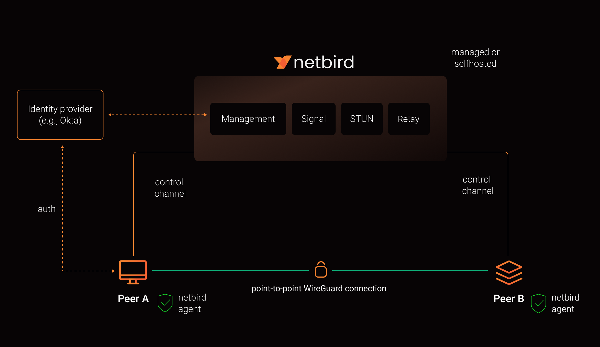

# NetBird Architecture & How It Works

> A beginner-friendly explanation of the NetBird architecture based on the diagram.

---

# Architecture Diagram

> **Insert the architecture image below**



---

# What is NetBird?

NetBird is an **Open Source Zero Trust Networking Platform** built on top of **WireGuard**.

It securely connects servers, virtual machines, containers, cloud instances, and personal devices into one private network.

Unlike traditional VPNs, NetBird tries to establish a **direct peer-to-peer encrypted connection** between devices whenever possible.

---

# Architecture Overview

The architecture consists of three main parts:

1. Identity Provider
2. NetBird Control Plane
3. Peer-to-Peer Data Plane

```
                    Identity Provider
                           │
                      Authentication
                           │
                           ▼
                  NetBird Control Plane
        ┌─────────────────────────────────────┐
        │ Management │ Signal │ STUN │ Relay │
        └─────────────────────────────────────┘
               ▲                      ▲
               │ Control Channel      │ Control Channel
               │                      │
          Peer A                  Peer B
               │                      │
               └──── WireGuard ───────┘
               Encrypted P2P Connection
```

---

# Main Components

## 1. Identity Provider (IdP)

Examples:

- Okta
- Google
- Azure AD
- Auth0
- Keycloak

### Responsibilities

- User Authentication
- Login
- Identity Verification
- Access Control

When a user logs in, NetBird asks the Identity Provider to verify the user's identity.

Without successful authentication, devices cannot join the private network.

---

## 2. NetBird Control Plane

The Control Plane manages the entire network.

It does **NOT** carry user traffic.

Instead, it controls how devices connect.

The Control Plane contains four services.

---

## 2.1 Management Service

```
Management
```

This is the brain of NetBird.

Responsibilities:

- Device registration
- User management
- IP assignment
- Peer information
- Access policies
- ACL management
- Network configuration

Every NetBird client first communicates with the Management Service.

---

## 2.2 Signal Service

```
Signal
```

The Signal Service helps two peers discover each other.

Responsibilities:

- Exchange connection information
- Exchange public endpoints
- Coordinate peer connection

It only exchanges signaling information.

It does **NOT** carry application traffic.

---

## 2.3 STUN Service

```
STUN
```

STUN stands for

**Session Traversal Utilities for NAT**

Most devices sit behind routers using NAT.

The STUN server helps a peer discover:

- Public IP address
- Public Port
- NAT type

This information is required to establish a direct connection.

---

## 2.4 Relay Service

```
Relay
```

Sometimes direct peer-to-peer communication is impossible.

Example:

- Strict Firewall
- Symmetric NAT
- Corporate Network

In that case, NetBird forwards encrypted traffic through the Relay Server.

```
Peer A

↓

Relay Server

↓

Peer B
```

The traffic remains encrypted.

---

# Peer A

Peer A is any device running the NetBird Agent.

Examples:

- Laptop
- Cloud Server
- VPS
- Raspberry Pi
- Virtual Machine

The NetBird Agent:

- Authenticates
- Connects to Management
- Receives configuration
- Creates WireGuard tunnel

---

# Peer B

Peer B works exactly like Peer A.

Both peers are equal.

There is no client-server communication.

Instead, both devices communicate directly whenever possible.

---

# Control Channel

The orange lines in the diagram represent the **Control Channel**.

The Control Channel is responsible for:

- Authentication
- Configuration updates
- Peer discovery
- Access policy updates

No application data passes through this channel.

---

# Data Plane

The green line represents the **Data Plane**.

```
Peer A

────────────── WireGuard ──────────────

Peer B
```

This is where application traffic flows.

Examples:

- SSH
- HTTP
- Database
- File Transfer

The traffic is encrypted using WireGuard.

---

# How NetBird Works

Let's understand the complete process.

---

## Step 1

User installs the NetBird Agent.

```
Laptop

↓

Install NetBird
```

---

## Step 2

The user logs in.

```
NetBird Agent

↓

Identity Provider

↓

Authentication Success
```

---

## Step 3

The device registers itself.

```
Agent

↓

Management Service

↓

Register Device
```

The Management Service assigns:

- Internal VPN IP
- Peer information
- Network configuration

---

## Step 4

Signal Service exchanges connection information.

```
Peer A

↓

Signal Service

↓

Peer B
```

Each peer learns:

- Public IP
- Public Port
- Connection candidates

---

## Step 5

STUN helps both peers discover their public addresses.

```
Peer

↓

STUN

↓

Public IP
```

This enables NAT Traversal.

---

## Step 6

NetBird attempts a direct connection.

```
Peer A

────────────

Peer B
```

If successful,

a WireGuard tunnel is created.

---

## Step 7

Encrypted communication begins.

```
SSH

↓

WireGuard Tunnel

↓

Remote Server
```

All application traffic flows directly between the peers.

---

## Step 8 (Fallback)

If direct connection fails,

NetBird automatically uses the Relay Server.

```
Peer A

↓

Relay

↓

Peer B
```

The data remains encrypted end-to-end.

---

# Complete Connection Flow

```
User

↓

Login

↓

Identity Provider

↓

Management Service

↓

Signal Service

↓

STUN

↓

Peer Discovery

↓

WireGuard Tunnel

↓

Encrypted Communication
```

---

# Why NetBird Uses WireGuard

WireGuard provides:

- Fast performance
- Modern cryptography
- Low latency
- Small codebase
- Strong security

NetBird builds its networking platform on top of WireGuard.

---

# Why Separate Control Plane and Data Plane?

Control Plane

- Authentication
- Configuration
- Peer Discovery
- Policy Management

Data Plane

- SSH
- HTTP
- Database Traffic
- File Transfer

Keeping them separate improves:

- Performance
- Scalability
- Security

---

# Advantages

- Open Source
- Zero Trust Networking
- End-to-End Encryption
- Automatic Peer Discovery
- Direct Peer-to-Peer Communication
- NAT Traversal
- Relay Fallback
- Easy Device Management
- Cross Platform
- Cloud Native

---

# How NetBird Fits into Our Project

In our platform, NetBird will provide secure private networking between all infrastructure components.

Example:

```
Developer

        │

Deploy Application

        │

Firecracker MicroVM

        │

Docker Container

        │

Private Network (NetBird)

        │

Managed PostgreSQL

        │

Storage Service
```

Instead of exposing every service to the public internet, all communication happens over a private encrypted network created by NetBird.

---

# Summary

NetBird is a Zero Trust networking platform built on top of WireGuard.

Its architecture is divided into two major parts:

- Control Plane (Management, Signal, STUN, Relay)
- Data Plane (WireGuard Peer-to-Peer Connection)

The Control Plane manages devices and establishes connections, while the Data Plane carries encrypted application traffic directly between peers.

This architecture provides secure, scalable, and high-performance private networking for cloud-native applications.