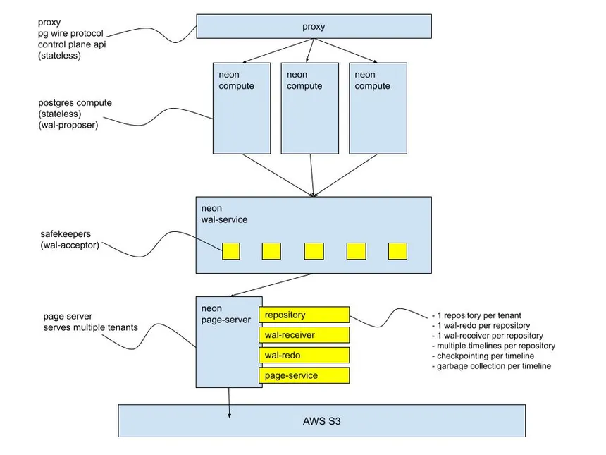

# Neon Database Architecture & How It Works

> A beginner-friendly explanation of Neon PostgreSQL architecture based on the architecture diagram.

---

# Architecture Diagram

> **Insert the architecture image below**



---

# What is Neon?

Neon is a **Serverless PostgreSQL Platform** that separates **Compute** and **Storage**.

Unlike traditional PostgreSQL, Neon does not keep CPU, RAM, and Storage on the same server.

Instead, Compute and Storage are independent services that communicate over the network.

This architecture makes Neon:

- Serverless
- Scalable
- Cost-efficient
- Cloud Native

---

# High-Level Architecture

```
                Client
                   │
                   ▼
               Proxy Layer
                   │
        ┌──────────┴──────────┐
        ▼          ▼          ▼
    Compute     Compute    Compute
        │          │          │
        └──────────┬──────────┘
                   ▼
             WAL Service
                   │
                   ▼
             Page Server
                   │
                   ▼
             Object Storage
                (AWS S3)
```

---

# Main Components

The architecture consists of five major components.

1. Proxy
2. Compute
3. WAL Service
4. Page Server
5. Object Storage

---

# 1. Proxy

```
Proxy
```

The Proxy is the entry point for every PostgreSQL connection.

Responsibilities:

- Accept PostgreSQL connections
- Route requests
- Find the correct Compute Node
- Stateless service

The Proxy does **not** execute SQL queries.

It simply forwards requests to an available Compute instance.

---

# Why Proxy?

Imagine there are multiple Compute Nodes.

```
          Proxy

      /     |     \

Compute1 Compute2 Compute3
```

Instead of connecting directly to a Compute node,

clients always connect to the Proxy.

The Proxy decides where the request should go.

---

# 2. Compute

```
Neon Compute
```

Compute is where PostgreSQL actually runs.

Every Compute node is a PostgreSQL server.

Responsibilities:

- Execute SQL queries
- Process transactions
- Perform JOINs
- Execute Index Scans
- Return query results

Compute is **stateless**.

This means it does not permanently store data.

It reads data from the Page Server whenever needed.

---

# Example

```
SELECT * FROM users;
```

The Compute Node:

- Parses SQL
- Optimizes Query
- Requests data pages
- Executes Query
- Returns Results

---

# Multiple Compute Nodes

The image shows multiple Compute nodes.

```
Compute A

Compute B

Compute C
```

Reasons:

- High availability
- Autoscaling
- Read scaling
- Independent compute environments

Different users can have different Compute instances.

---

# 3. WAL Service

```
Neon WAL Service
```

WAL stands for

**Write Ahead Log**

Every database write is recorded here first.

Example:

```
INSERT

↓

WAL

↓

Storage
```

Responsibilities:

- Accept WAL records
- Replicate WAL
- Ensure durability
- Prevent data loss

---

# SafeKeepers

Inside the WAL Service there are multiple SafeKeepers.

```
SafeKeeper

SafeKeeper

SafeKeeper

SafeKeeper
```

Each SafeKeeper stores WAL logs.

Benefits:

- Data durability
- Replication
- High availability
- Crash recovery

If one SafeKeeper fails,

others still have the WAL records.

---

# 4. Page Server

```
Page Server
```

The Page Server stores actual PostgreSQL data pages.

Unlike PostgreSQL,

Compute does not store database files locally.

Instead,

Compute requests pages from the Page Server.

Responsibilities:

- Store database pages
- Serve requested pages
- Manage timelines
- Checkpoint management
- Garbage collection

The Page Server can serve multiple tenants.

---

# Internal Components of the Page Server

The architecture shows four internal modules.

## Repository

Stores metadata about database timelines and repositories.

---

## WAL Receiver

Receives WAL records from the WAL Service.

Updates storage using incoming WAL changes.

---

## WAL Redo

Applies WAL records to reconstruct database pages.

Example:

```
Old Page

+

WAL Records

↓

Updated Page
```

---

## Page Service

Returns requested pages to Compute.

Example:

```
Compute

↓

Request Page

↓

Page Server

↓

Return Page
```

---

# Timelines

One repository can have multiple timelines.

A timeline represents a version of the database.

Example:

```
Production

│

├── Timeline A

├── Timeline B

└── Timeline C
```

This feature enables:

- Database Branching
- Point-in-Time Recovery
- Snapshots

---

# Checkpoints

The Page Server periodically creates checkpoints.

Benefits:

- Faster recovery
- Less WAL replay
- Better performance

---

# Garbage Collection

Old pages and unnecessary WAL records are automatically removed.

This saves storage space.

---

# 5. Object Storage

```
AWS S3
```

At the bottom of the architecture is object storage.

Neon stores persistent data here.

Examples:

- AWS S3
- Cloud Storage
- Object Storage

Responsibilities:

- Permanent storage
- Snapshots
- Backups
- Historical data

Storage remains available even if Compute stops.

---

# Complete Query Flow

## Read Query

```
Client

↓

Proxy

↓

Compute

↓

Page Server

↓

Object Storage (if needed)

↓

Page Server

↓

Compute

↓

Client
```

---

# Write Query

```
Client

↓

Proxy

↓

Compute

↓

WAL Service

↓

SafeKeepers

↓

Page Server

↓

AWS S3

↓

Success Response
```

---

# Why Separate Compute and Storage?

Traditional PostgreSQL

```
CPU
RAM
Storage
```

Everything lives on one server.

Neon

```
Compute

↓

Network

↓

Storage
```

Benefits:

- Independent scaling
- Better resource utilization
- Scale to zero
- High availability
- Faster recovery

---

# Autoscaling

If traffic increases,

Neon creates larger or additional Compute nodes.

```
10 Users

↓

Small Compute

1000 Users

↓

Larger Compute
```

Storage remains unchanged.

---

# Scale to Zero

When there are no active connections,

Compute can stop.

```
Compute

OFF
```

Storage remains online.

When a new query arrives,

Compute starts again automatically.

---

# Advantages

- Serverless PostgreSQL
- Compute and Storage Separation
- Autoscaling
- Scale to Zero
- High Availability
- WAL Replication
- Object Storage
- Fast Recovery
- Database Branching
- Point-in-Time Recovery

---

# How Neon Fits into Our Project

In our platform, Neon architecture inspires the design of our managed database service.

Example:

```
Developer

↓

Create Database

↓

API Gateway

↓

Scheduler

↓

Start Compute

↓

Connect to Storage

↓

Return PostgreSQL Endpoint
```

Instead of storing everything inside one PostgreSQL server,

our platform can separate:

- Compute
- Storage
- WAL
- Object Storage

This allows the platform to scale efficiently while keeping storage persistent.

---

# Summary

Neon is a cloud-native PostgreSQL architecture that separates Compute from Storage.

Its main components are:

- Proxy
- Compute
- WAL Service
- SafeKeepers
- Page Server
- Object Storage

The Proxy routes requests, Compute executes SQL queries, WAL Service guarantees durability, Page Server manages database pages, and Object Storage keeps data permanently.

This architecture enables autoscaling, serverless compute, high availability, database branching, and efficient cloud-native PostgreSQL services.